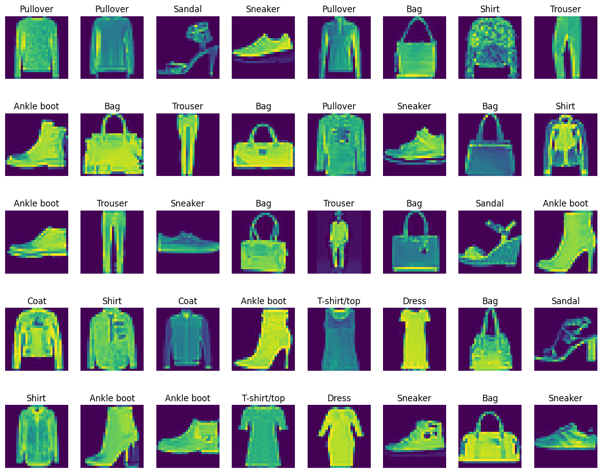
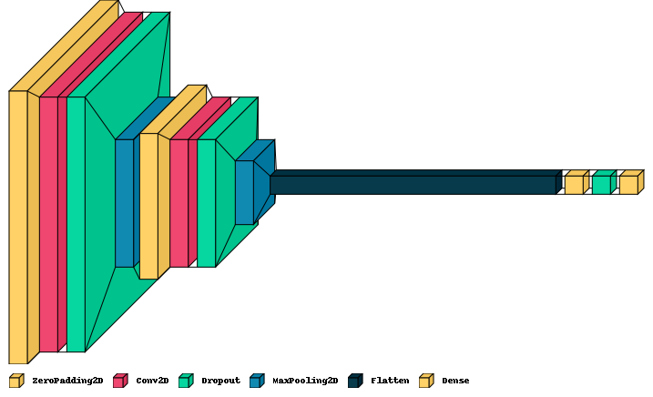
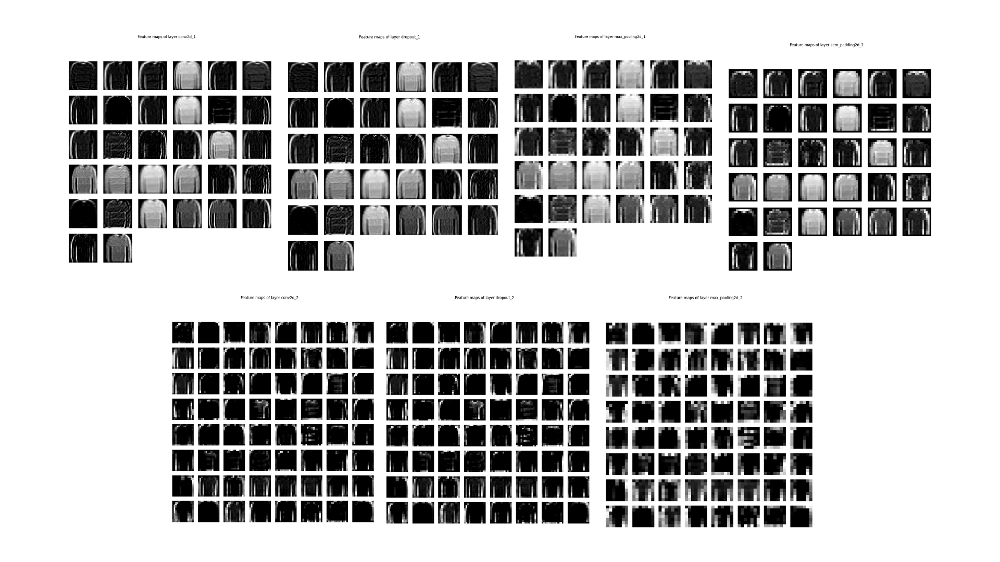
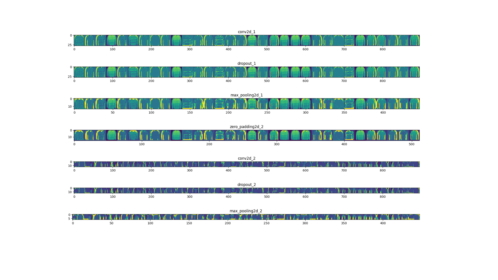

# Fashion MNIST Classification

## Objective

The objective of this project is to develop a Convolutional Neural Network (CNN) to classify images from the Fashion MNIST dataset. The goal is to achieve high accuracy in predicting the category of clothing items, while also understanding the model's internal workings through feature map analysis.

## Dataset Description

The Fashion MNIST dataset consists of 70,000 grayscale images in 10 categories, with 7,000 images per category. The images are of size 28x28 pixels. The dataset is divided into a training set of 60,000 images and a test set of 10,000 images. The 10 categories are:

1. T-shirt/top
2. Trouser
3. Pullover
4. Dress
5. Coat
6. Sandal
7. Shirt
8. Sneaker
9. Bag
10. Ankle boot

## Preprocessing Phase

To prepare the data for training, the following preprocessing steps were taken:

1. Normalization: The pixel values were scaled to the range [0, 1].
2. Reshaping: The images were reshaped to include the channel dimension (28, 28, 1).
3. One-hot Encoding: The labels were converted to one-hot encoded vectors.

## Model Architecture

The Convolutional Neural Network (CNN) used in this project has the following architecture:

1. **Input Layer**: 28x28x1 grayscale images.
2. **Zero Padding Layer**: Adds zero padding to the input, resulting in 30x30x1 images.
3. **First Convolutional Layer**: 32 filters, kernel size 3x3, ReLU activation.
4. **Dropout Layer**: 0.5 dropout rate to prevent overfitting.
5. **Max Pooling Layer**: Pool size 2x2, resulting in 14x14x32 feature maps.
6. **Zero Padding Layer**: Adds zero padding to the feature maps, resulting in 16x16x32 feature maps.
7. **Second Convolutional Layer**: 64 filters, kernel size 3x3, ReLU activation.
8. **Dropout Layer**: 0.5 dropout rate to prevent overfitting.
9. **Max Pooling Layer**: Pool size 2x2, resulting in 7x7x64 feature maps.
10. **Flatten Layer**: Converts 2D feature maps to 1D feature vectors.
11. **Fully Connected Layer**: 128 neurons, ReLU activation.
12. **Dropout Layer**: 0.5 dropout rate to prevent overfitting.
13. **Output Layer**: 10 neurons (one for each category), Softmax activation.

## Training Phase

The model was trained using the following configuration:

- **Optimizer**: Adam optimizer.
- **Loss Function**: Categorical Crossentropy.
- **Number of Epochs**: 5.
- **Batch Size**: 300.

## Evaluation Phase

The model's performance was evaluated using the following metrics:

- **Accuracy**: The proportion of correctly predicted labels.
- **Loss**: The categorical crossentropy loss on the test set.

Results:
- **Training Accuracy**: [88.7]
- **Test Accuracy**: [89.36]

## Feature Maps Analysis

Feature maps were analyzed at various stages of the network:

1. **First Layer**: These feature maps capture basic edges and textures.
2. **Intermediate Layer**: These feature maps start to capture more complex patterns and parts of the clothing items.
3. **Last Layer**: These feature maps are highly abstract and represent the learned features that contribute to the final classification decision.

The differences among these feature maps highlight how the CNN progressively learns and abstracts features from raw pixel values to high-level concepts.

In neural networks, the final layers activate only those features that are important for class recognition. As seen from the output of the final layers, only a few features or pixels in the abstract space at the end of the network are activated. This indicates that the outputs of the final layers contain less information from the original input image pixels, but instead, they retain precise information about the key pixels that determine the output class. Therefore, it can be said that the images resulting from the initial layers are closer to the original input image, while the outputs of the final layers, by highlighting specific features in an abstract and compressed space, determine the type of output class.

## Additional Insights

### Potential Applications

This model can be applied to real-world fashion retail systems for automated tagging and classification of clothing items. It can also be integrated into recommendation systems to suggest similar items to users.

### Future Work

Future improvements could include:

- Experimenting with different architectures and hyperparameters.
- Using transfer learning with pre-trained models on larger datasets.
- Deploying the model as a web service for real-time classification.

